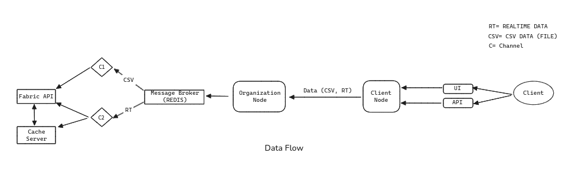
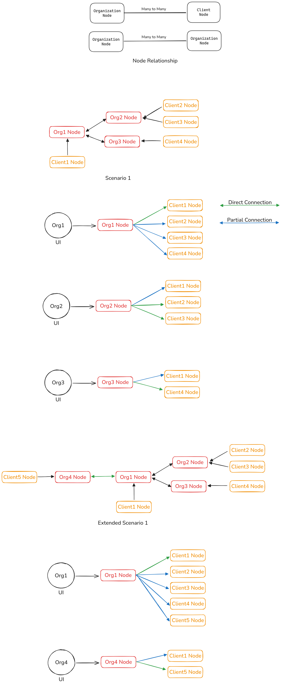

# rec_dlt
## Usage instructions
This guide covers the installation and setup process for the REC System, including agent configuration and Fabric network deployment.

## Prerequisites

- Node.js version >= 18.18
- Redis server
- Docker
- Add docker to sudo group to use docker without using sudo
- Install JQ by running command `sudo apt install -y jq`

## Installation Steps

### 1. Organization and Client Api Setup
1. Navigate to the agent directory and install dependencies. This SDK includes both REC Agent and Client Agent functionalities.
```
cd agent
yarn
```
2. Add the following variables to your `.env` file:

```
FABRIC_API='http://localhost:3005'
```
3. Start an organization api:
```
yarn org <email> <port>
```
4. Start a client api:
```
yarn client <email> <port>
```
Replace `<email>` with the actual email of the organization or client, and `<port>` with the port number on which you want the API to run. Example: `yarn org org1@rec.com 5000` or `yarn client client1@rec.com 5001`

### 2. Fabric Network Setup

The following steps will set up and configure the Fabric network:

1. Copy the .env.sample file to a new .env file, and update all path variables according to your local setup.
```bash
cd service/rec/server
cp .env.sample .env
```
**Do not forget to change the path variables**

2. Run `installPrerequisite.sh` once during the initial server setup to install all necessary dependencies:
```bash
cd service/rec
./installPrerequisite.sh
```

3. Start the Hyperledger Fabric network and deploy the chaincode:
```bash
./startNetwork.sh
```
4. A Redis server must be running either on Docker or localhost using the default port. To run Redis using Docker:
```bash
docker run --name redis-server -p 6379:6379 -d redis
```

5. Start the server. This will also start the Fabric Subscriber Service which is connected with the REC Agent (Publisher)
```bash
cd service/rec/server
npm run dev
```
Fabric server will run at PORT 3005

### 4. Organization Interface Setup
Configure and start the Organization Interface as follows:

1. Add the following variables to your `.env` file:
```
FABRIC_API=http://localhost:3005
```

2. Navigate to the `organizationInterface` directory, install dependencies, and start the interface server:
```
cd ../organizationInterface
npm install
npm run dev
```
Organization Interface server will run on port 3000

### Key notes
- Please open the client and organization interface in a separate window (not a separate tab, same window) or browser for each client and organization at the same time. This may cause a conflict with the local storage data of separate clients or organizations in the browser.

### Client Interface Setup
Configure and start the Client API as follows:
1. Add the following variables to your `.env` file:
```
JWT=secret
FABRIC_API=http://localhost:3005
```
2. Navigate to the `clientInterface` directory, install dependencies, and start the interface server:
```
cd ../clientInterface
npm install
npm run dev
```
Client Interface server will run on port 3001

### CSV data generation
1. Navigate to data directory and install dependencies
```
cd data
npm install
```
2. Run this command to generate data
```
npm run dataGenerate
```
3. You can view data format in rec2.csv file
4. To understand to process of data generation, view data-gen.js file.


### Realtime api to send data
1. Navigate to data directory and install dependencies
```
cd data
npm install
```
2. Copy environment data from .env.sample
```
cp .env.sample .env
npm run repeatedApiCall
```
3. To understand to process of realtime api call, view repeatedApiCaller.js file.


## Architecture 
#### Data flow 


## Components
- Interface
- Agents
- Fabric API
- Message Broker


## API Documentation

### Organization API Endpoints

| Method | Endpoint            | Request Body | Response                                    | Description                                      |
|--------|---------------------|--------------|---------------------------------------------|--------------------------------------------------|
| POST   | /create-invitation | {}           | Returns a new oob invitation               | Creates and returns a new out-of-band invitation |
| POST   | /receive-invitation | {invitationUrl}                                   | Establishes connection with given invitationUrl             | Initiates a connection and returns invitation details          |
| POST   | /receive-message    | {message, connectionId} | Sends message to a specific connection | Sends a message to a specific connection and returns a response |


### Client API Endpoints
| Method | Endpoint            | Request Body                                      | Response                                                    | Description                                                     |
|--------|---------------------|---------------------------------------------------|-------------------------------------------------------------|----------------------------------------------------------------- 
| POST   | /receive-invitation | {invitationUrl}                                   | Establishes connection with given invitationUrl             | Initiates a connection and returns invitation details          |
| POST   | /send-message       | {connectionId, messageData, organizationId: email}| Sends message to organization node and returns specific message| Sends a message to a recipient node and returns a specific response|


### Fabric API

| Method | Endpoint                   | Request Body        | Response                                     | Description                                            |
|--------|----------------------------|---------------------|----------------------------------------------|--------------------------------------------------------|
POST    | /client/register   | {name, email, agentEndpoint, password}  |  Returns success message | Registers a new client using given credentials.
POST    | /client/login      | {email, password} | Returns success message, clientData  | Logs in a client and sets an authorization cookie.
POST    | /organization/register   | {name, email, agentEndpoint, password}  |  Returns success message | Registers a new organization using given credentials.
POST    | /organization/login      | {email, password} | Returns success message, clientData  | Logs in a organization and sets an authorization cookie.
GET | /organization/all | N/A | Returns all organization data | Fetches all organizations.
GET | /client/connections | N/A | Returns connected organization data  | Fetches client connections if the user is authenticated, otherwise returns a 401 error.
GET | /organization/realtime-data/:connectionId | N/A | Returns realtime data of a specific client | Fetches real-time data if the organization is authenticated.
GET | /organization/connected-organization/clients/{email} | N/A | Returns array of clients data | Fetches the list of clients of a different organization connected to this user based on the provided email.
GET | /organization/connection/organizations | N/A | Returns array of connected organizations | Fetches the list of organizations connected to the current user.
GET | /organization/sorted-data/:connectionId | N/A | Returns array of message data sent by a client | Fetches sorted data for a connected client based on connectionId.
POST | /organization/connected-organization/clients/sorted-data | {connectedOrganizationId, connectionId} | Returns array of message data sent by a client | Fetches sorted data sent by a client to a connected organization.


## Scenario

